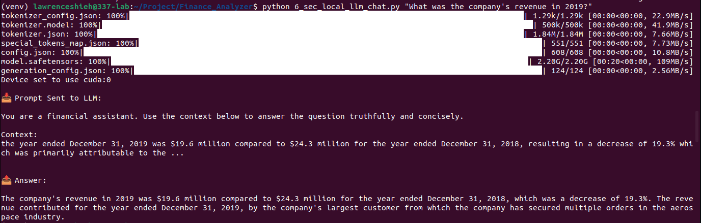

# 📊 SEC Financial Statement QA Chatbot (RAG + Local LLM)

This project builds a **retrieval-augmented generation (RAG)** pipeline over SEC 10-K/10-Q filings, enabling a local language model to answer questions like:

> "What was the company’s revenue in 2019?"  
> "Summarize the management discussion section from the latest 10-K."

It uses chunked embedding search with FAISS and a local LLM (e.g., TinyLlama) to generate grounded answers.


## 📂 Project Workflow

| Step | Script                          | Description                                          |
|------|---------------------------------|------------------------------------------------------|
| 1️⃣   | `1_sec_json_data_retriever.py`     | Download SEC `companyfacts.zip` and `submissions.zip` metadata |
| 2️⃣   | `2_sec_text_data_retriever.py`     | Use metadata to fetch full 10-K / 10-Q HTML files    |
| 3️⃣   | `3_sec_text_data_processor.py`     | Extract, clean, and chunk filings with metadata      |
| 4️⃣   | `4_sec_text_embedding_generator.py`| Generate SBERT embeddings for each chunk             |
| 5️⃣   | `5_embedding_indexer.py`           | Build FAISS index and save metadata mapping          |
| 6️⃣   | `6_sec_local_llm_chat.py`          | Query using local LLM + retrieved context            |

## 🛠️ Setup Instructions

### 1. Install Dependencies

```bash
pip install -r requirements.txt
```

You’ll need:

- `transformers`
- `sentence-transformers`
- `faiss-cpu`
- `tqdm`
- `beautifulsoup4`
- `huggingface-hub`


### 2. Run the Full Data Pipeline

```bash
# Download JSON bulk metadata
python 1_sec_json_data_retriever.py

# Fetch actual HTML filings
python 2_sec_text_data_retriever.py

# Clean and chunk documents
python 3_sec_text_data_processor.py

# Embed each chunk
python 4_sec_text_embedding_generator.py

# Index embeddings with FAISS
python 5_embedding_indexer.py
```


### 3. Ask Questions Using a Local Model

```bash
python 6_sec_local_llm_chat.py "What is the revenue in 2019?"
```

The script will:
- Embed the query
- Retrieve relevant chunks from FAISS
- Send the context to a local model (TinyLlama by default)
- Print the generated answer

> 💡 You can switch to GPT-4 or Claude with a few lines of modification if needed.

## 📷 Example: Script 6 Output (Chat with Local LLM)

After you run:

```bash
python 6_sec_local_llm_chat.py "What is the revenue in 2019?"
```

You should see output like this:



This shows the retrieved SEC filing chunks and the final answer generated by the local LLM.


## 🔍 How It Works

1. Query → SBERT embedding
2. FAISS retrieves top relevant chunks
3. Prompt is constructed with context
4. LLM generates an answer based on the retrieved evidence


## 📁 Data Folder Overview

| Folder                        | Description                                          |
|------------------------------|------------------------------------------------------|
| `data/xbrl_data/`            | JSON company facts from SEC bulk download           |
| `data/submissions_data/`     | SEC submission history for each CIK                 |
| `data/filings_html/`         | Downloaded raw 10-K/10-Q HTML files                 |
| `data/cleaned_filings/`      | Chunked JSONs with metadata (year, form, section)   |
| `data/embeddings_chunked/`   | Chunk-level SBERT embeddings                        |
| `data/faiss_index_chunked/`  | FAISS index and lookup metadata                     |


## 🧠 Default Local Model

The default model is:

```
TinyLlama/TinyLlama-1.1B-Chat-v1.0
```

If you want to use larger or gated models:
1. Get access on HuggingFace
2. Run: `huggingface-cli login`
3. Replace the model ID in `6_sec_local_llm_chat.py`


## 🚀 Future Improvements

- OpenAI/Claude fallback option
- Streamlit or Gradio chat interface
- Incremental updates from EDGAR
- Financial summarization or comparison engine
- CSV or PDF export of Q&A answers

---

## 🤝 Contact

Created by Lawrence Shieh
📧 lawrence92@berkeley.edu

PRs and suggestions welcome!
